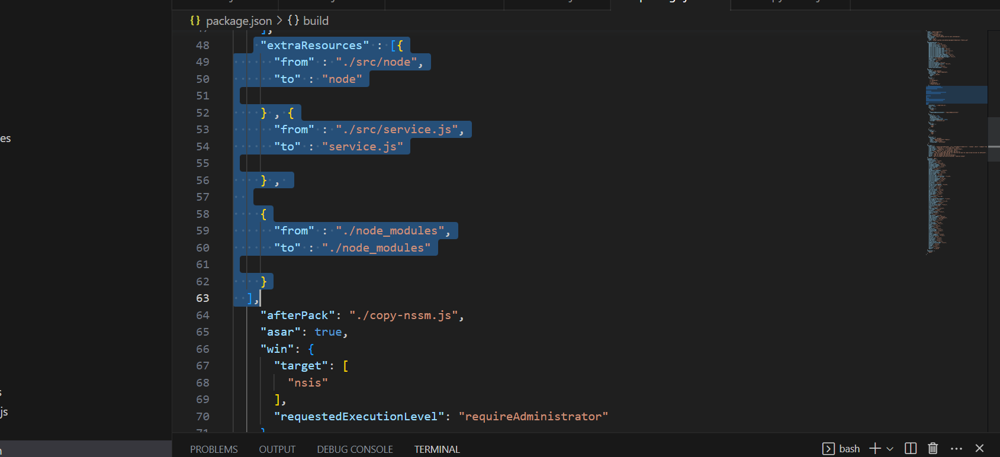

# app work as a service

we will use os-service library for this task 
### instalation 
```sh
  npm i os-service
  npm i node-file-logger
```

this library excute a node script as a service and not electron so we need to package nodejs with the app

- first go to https://nodejs.org/en/download and download Windows Binary (.zip)
- create a folder call node in src folder  and unziped there
- 
- go to package.json file and go to the build section and add this 
- ```sh
   "extraResources" : [{
      "from" : "./src/node",
      "to" : "node"

    } , {
      "from" : "./src/service.js",
      "to" : "service.js"

    } , 
  
    {
      "from" : "./node_modules",
      "to" : "./node_modules"

    }
  ],
-   
-  in scripts tag change this :
 ```sh
 "scripts": {
    "obfuscate": "javascript-obfuscator ./src --output ./dist/ --compact true --self-defending true",
  ```
 to this : 
  ```sh
 "scripts": {
    "obfuscate": "javascript-obfuscator ./src --exclude=src/node/**/**  --output ./dist/ --compact true --self-defending true",
  ```

-  in src folder create a file service.js, this is the service.js script:
-  

```sh
const log = require('node-file-logger');
const path = require('path');
const options = {
  folderPath: './logs/',
  dateBasedFileNaming: false,
  fileName: 'All_Logs.log', 
  dateFormat: 'YYYY_MM_D',
  timeFormat: 'h:mm:ss A',
}
log.SetUserOptions(options); // Options are optional


const args = process.argv[1];

const exec = require('child_process').exec;

log.Info(process.argv[2].toString());
exec('"' + process.argv[2].toString() + '" --run-as-service', function (err, stdout, stderr) {
  

    if (err) {
      log.Error( err);

        //throw err;
    }

    log.Error( stderr);
}) 
```
- now go to index.js and change createWindow function to this
```sh
function createWindow() {
  // Check if the main window is already open
  if (win === null || typeof win === 'undefined' || win.isDestroyed()) {


 
      isServiceRunning().then(isRunning => {
        if (!isRunning) {
          log.error("Agent Sebastian Service is not running");

          // Start the service
          startService().then(() => {
            // Create the window after starting the service
            log.info("Service was not running, it is now running.");
          }).catch(err => {
            log.error("Failed to start the Agent Sebastian Service", err);
            let execPath;

            execPath = path.join(path.dirname(app.getPath('exe')), "Agent Sebastian.exe");

            if(app.isPackaged){
              service.add("AgentSebastianController", {

                nodePath:   path.join(path.dirname(app.getPath('exe')), "resources" , "node", "node.exe") ,
  
                programPath: path.join(path.dirname(app.getPath('exe')), "resources" , "service.js") ,
                programArgs: [execPath]
              }, function (error) {
                if (error)
                  console.trace("Error service  : ", error);
  
                service.run(function () {
                 
                });
                showWin()
              });
            }
          
            //  Alert.showError('Service Not Running', 'Agent Sebastian Service could not start.');
          });

        } else {
          showWin()
          return;
        }
      });
   
  }
}

```
- and add this fuction after createWindow 
```sh

function showWin() {
   // If it's not open, create the window
   win = new BrowserWindow({
    webPreferences: {
      preload: path.join(__dirname, 'preload.js'),
      enableRemoteModule: false,
      nodeIntegration: false
    }
  })

  win.loadFile(path.join(__dirname, 'index.html'))
  win.setTitle("version :" + version)

  win.on('close', (e) => {

    e.preventDefault();
    win.hide()
  });
}
```
- now go to app.on('ready') event and deleted the code and add   this 
- 
```sh
 

const gotTheLock = app.requestSingleInstanceLock()
if (!gotTheLock) {
  app.quit()
} else {
  app.on('second-instance', (event, commandLine, workingDirectory) => {
    // Someone tried to run a second instance, we should focus our window.
    if (win) {
      if (win.isMinimized()) win.restore()
      win.focus()
      win.show()

    }
  })

  app.on('ready', async () => {

    Alert = require('./alert')


    if (!process.argv.includes('--run-as-service')) {
      log.info("Gui launched");
      createWindow();
    }

    if (process.argv.includes('--run-as-service')) {
      log.info(`App version: ${version}`);
      autoUpdater.checkForUpdates();

      await updateJobs();
      setInterval(updateJobs, 900000);

      await updateRestorePoints();
      setInterval(updateRestorePoints, 900000);

      await updateVeeamSessions();
      setInterval(updateVeeamSessions, 900000);

      await updateVeeamVersion();
      setInterval(updateVeeamVersion, 14400000);

      await updateVeeamS3CompatibleOrWasabiRepos();
      setInterval(updateVeeamS3CompatibleOrWasabiRepos, 1200000);

      await updateVeeamAzureRepos();
      setInterval(updateVeeamAzureRepos, 1200000);

      await updateGoogleCloudRepos();
      setInterval(updateGoogleCloudRepos, 1200000);

      await updateVeeamLicenseCounts();
      setInterval(updateVeeamLicenseCounts, 21600000);

      await revertToOriginalConfigCredential();

      await handleConfigBackup();
      setInterval(handleConfigBackup, 3600000);
    }
    //await createAppTray();
  });
}

```


